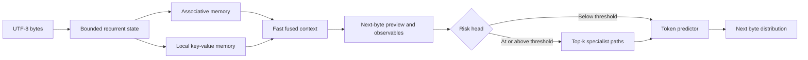

# Koemi-1FPA

[](https://www.python.org/)
[](https://pytorch.org/)
[](#dataset-contract)

Koemi-1FPA is a CPU-first PyTorch reference model exploring recurrent state, associative memory, and per-token adaptive compute for byte-level language modeling. Research MVP with a CLI for training and generation.

`1FPA` stands for First Prototype Architecture. It is the first of a series, and the number is there so a later architecture can break its contracts without renaming the project.

## What it is for

Adaptive-compute claims are easy to state and hard to verify. A router that sends hard tokens through an expensive path and easy tokens through a cheap one only saves compute if someone measures which tokens the deep path actually helps. Koemi exists to make that measurable on a laptop: the router is trained against a label derived from the loss difference between the two paths, and the benchmark reports the deep-path fraction next to loss, throughput, and state size.

The code is a research MVP. It is not a production model and it does not claim Transformer-level quality.

## Install

Requirements: Python 3.11 or newer, and pip.

```bash
python -m venv .venv
.venv/bin/python -m pip install --upgrade pip
.venv/bin/python -m pip install -e .
```

On Windows, replace `.venv/bin/python` with `.venv\Scripts\python`.

## Dataset contract

The core accepts `.json` arrays and `.jsonl` files. Each normalized record uses this shape:

```json
{
  "id": "queue-001",
  "input": "Explain FIFO in one sentence.",
  "thinking": null,
  "output": "FIFO means first in, first out.",
  "metadata": {
    "source": "example"
  }
}
```

`thinking` is optional. Records without it train as ordinary causal language-model examples. When it is present, its bytes are included as supervised targets before `output`.

For plain text, set `output` to `null`. The complete `input` field becomes the training sequence.

The loader also recognizes these source layouts through explicit adapters:

- Alpaca: `instruction`, `input`, `output`
- ShareGPT: `conversations` with `human` or `user`, and `gpt` or `assistant`

The core does not infer arbitrary JSON field meanings. Invalid types, unsupported suffixes, malformed JSON, and files larger than 64 MiB fail with an error.

Inspect a dataset before training:

```bash
.venv/bin/python -m koemi inspect-dataset --dataset examples/canonical.jsonl
```

## Train

```bash
.venv/bin/python -m koemi train --dataset examples/canonical.jsonl --checkpoint artifacts/koemi-1fpa.pt --overwrite --epochs 2 --embedding-size 32 --memory-features 8 --local-memory-size 8 --deep-steps 1 --active-specialists 1
```

Training runs in `calibration` mode by default. Every valid token goes through both the fast path and the deep path, and the per-token loss difference between them becomes the router's supervision label. The command logs dataset counts, task loss, fast-path loss, deep-path loss, router loss, router accuracy, hard-token fraction, mean risk, deep-route fraction, and per-specialist activation counts. It never logs example content.

Pass `--routing-mode hard` to train with threshold routing instead. That mode is cheaper per step, produces no router supervision, and leaves the risk head untrained.

## Generate

```bash
.venv/bin/python -m koemi generate --checkpoint artifacts/koemi-1fpa.pt --prompt "FIFO means" --max-new-bytes 64
```

Generation always uses hard routing: a token enters the deep path when its risk crosses `--risk-threshold`. The default sampler is stochastic; use `--temperature` to change sampling sharpness.

## How routing works

The fast path fuses the recurrent state, the associative memory read, and the local memory read, then reads out a next-byte distribution. Three observables come out of that step:

- `uncertainty` — normalized entropy of the fast distribution
- `conflict` — normalized distance between the recurrent state and the memory read
- `novelty` — one minus the highest cosine similarity against the local key buffer

The risk head is a linear map over those three observables plus the fused context, followed by a sigmoid. It is trained, not hand-weighted. During calibration the trainer computes the per-token cross entropy of both paths, labels a token `hard` when the deep path lowers the loss by more than `--hard-margin`, and fits the risk head with binary cross entropy against that label. A compute penalty on mean risk pulls in the other direction, so the router pays for the compute it asks for.

Specialist selection is separate. `--active-specialists` paths are chosen by top-k over a routing projection, mixed by a softmax over the selected scores, and a Switch-style load-balance penalty discourages collapse onto one path. The five paths share one class and one set of hyperparameters. They are numbered, not named, because nothing in the objective binds a path to a role; per-specialist activation counts are logged so specialization can be checked rather than assumed.

## Configuration

Model options, used by `train` and stored in the checkpoint:

| Option | Default | Effect |
| --- | ---: | --- |
| `--embedding-size` | `64` | Width of the recurrent state and token embedding. |
| `--memory-features` | `16` | Width of the associative memory features. |
| `--local-memory-size` | `16` | Number of exact local key-value entries. |
| `--deep-steps` | `2` | Internal updates per selected specialist. |
| `--active-specialists` | `2` | Specialists selected for a deep token. |
| `--risk-threshold` | `0.65` | Risk required to enter the deep path under hard routing. |
| `--exploration-interval` | `0` | Force a deep route every N model steps; `0` disables it. |

Training options:

| Option | Default | Effect |
| --- | ---: | --- |
| `--sequence-length` | `128` | Bytes per causal chunk. |
| `--batch-size` | `4` | Chunks per optimizer step. |
| `--epochs` | `3` | Passes over the dataset. |
| `--learning-rate` | `0.001` | AdamW learning rate. |
| `--gradient-clip-norm` | `1.0` | Global gradient norm cap. |
| `--routing-mode` | `calibration` | `calibration` runs both paths and trains the router; `hard` routes by threshold. |
| `--hard-margin` | `0.05` | Nats of loss improvement required to label a token `hard`. |
| `--router-loss-weight` | `1.0` | Weight of the router's binary cross entropy. |
| `--compute-penalty-weight` | `0.05` | Weight of the penalty on mean risk. |
| `--balance-loss-weight` | `0.01` | Weight of the load-balance penalty over specialists. |

## Architecture



The associative memory keeps a fixed-size learned state with a decay gate. The local memory retains recent key-value pairs exactly within its configured window. Both are created per forward call and reset for every batch or generation request, so there is no memory that outlives a request.

## Benchmark

`benchmarks/run_benchmark.py` trains Koemi and two recurrent baselines on the same seeded synthetic data and reports loss, bits per byte, throughput, peak resident memory, recurrent state size, and the deep-path token fraction. Each model runs in its own process so the memory peak belongs to one model.

```bash
.venv/bin/python benchmarks/run_benchmark.py --task bytes --report artifacts/bench-bytes.json
.venv/bin/python benchmarks/run_benchmark.py --task recall --report artifacts/bench-recall.json
```

The GRU and LSTM baselines are parameter-matched to Koemi by searching their hidden size, so the comparison is at equal parameter count and not equal width. The `recall` task is a key-value lookup: the sequence lists `key=value` pairs, then queries one key, and only the answer bytes are supervised. It is the cheap local stand-in for associative recall.

At about 161k parameters, 48 training records, and 2 epochs on a 4-thread CPU:

| Task | Model | Bits per byte | Eval tokens/s | State bytes/sequence |
| --- | --- | ---: | ---: | ---: |
| bytes | Koemi-1FPA | 3.653 | 466 | 7,152 |
| bytes | GRU | 3.216 | 7,095 | 656 |
| bytes | LSTM | 3.542 | 11,606 | 1,152 |
| recall | Koemi-1FPA | 7.607 | 76 | 7,152 |
| recall | GRU | 5.194 | 760 | 656 |
| recall | LSTM | 5.240 | 1,736 | 1,152 |

Koemi loses on every column. The deep path is also not earning its keep: the trained router sends 0.1% of tokens through it on `bytes` and 1.6% on `recall`, and the loss difference against the fast path there is under 0.001 nats. That is the router working correctly on a deep path that currently adds nothing.

The budget is deliberately small enough to finish on a laptop, and no model solved `recall` at it, so these numbers rank optimization behavior rather than architectural ceilings. The full tables, the environment, the caveats, and the next measurements are in [`docs/BENCHMARK.md`](docs/BENCHMARK.md).

## Related work

Koemi borrows from four lines of work and copies none of them whole.

**Titans and MIRAS** ([Behrouz et al., 2501.00663](https://arxiv.org/abs/2501.00663); [Behrouz et al., 2504.13173](https://arxiv.org/abs/2504.13173)) treat sequence modeling as memory management and update a neural memory module while the sequence runs. Koemi keeps the framing and drops the mechanism: the associative memory here is a bounded decayed statistic with no inner gradient step, chosen so numerical stability can be separated from expressivity.

**Mixture-of-Depths** ([Raposo et al., 2404.02258](https://arxiv.org/abs/2404.02258)) allocates compute per token by letting a router pick a top-k subset of tokens for the expensive block. Koemi's per-token fast and deep split is the same idea applied to a recurrent backbone, with one difference: the routing decision here is supervised by a measured loss gap instead of learned end-to-end through the block.

**Adaptive Computation Time** ([Graves, 1603.08983](https://arxiv.org/abs/1603.08983)) learns how many recurrent steps to spend per input, with a ponder cost to stop the model from spending forever. `--deep-steps` is the fixed-budget version of that, and the compute penalty on mean risk is the ponder cost.

**Switch Transformer** ([Fedus et al., 2101.03961](https://arxiv.org/abs/2101.03961)) contributes the load-balance penalty used to keep specialist selection from collapsing onto one path.

The deeper reading list, including the recall results that motivate the local key-value buffer, is in [`docs/KOEMI_ARCHITECTURE.md`](docs/KOEMI_ARCHITECTURE.md).

## Known limitations

- There is no long-term memory. Every state is created per forward call and dies with the request. Nothing persists across requests, and nothing is written back into the weights.
- The tokenizer uses UTF-8 bytes. It accepts arbitrary text without a trained vocabulary, and it spends more positions per word than a learned BPE tokenizer. The ratio depends on the language and the corpus, so this repository does not quote one until it measures it.
- The reference model steps through the sequence in Python. The benchmark shows what that costs against a cuDNN-backed GRU at the same parameter count.
- The router is trained, but a trained router is not a calibrated one. No out-of-distribution, coverage, or confidently-wrong test has been run yet.
- The five specialist paths share one class. Nothing in the objective forces them to learn different functions.
- The checkpoint holds model weights only. There is no persistent episodic memory, retrieval system, tool use, or tenant storage.
- A generated answer can still be wrong. Extra compute on uncertain tokens does not create missing factual knowledge.

## Project layout

```text
src/koemi/
  configuration/  Runtime settings and constants
  data/           JSON validation, adapters, serialization, tokenizer
  model/          Recurrent state, memory, router, specialists, network
  observability/  English runtime logging
  training/       Causal chunks, router objective, trainer, checkpoint, generation
benchmarks/       Koemi against parameter-matched GRU and LSTM baselines
tests/
  data/           Dataset and serialization contracts
  model/          Model shape, routing, and gradient checks
  training/       Training, checkpoint, and generation checks
examples/         Valid JSON and JSONL inputs
```

## Test

```bash
.venv/bin/python -m unittest discover -s tests -v
```

## License

This project is licensed under the MIT License. See [LICENSE](LICENSE).
