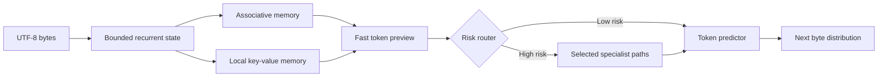

# Koemi-1FPA

[](https://www.python.org/)
[](https://pytorch.org/)
[](#dataset-contract)

Koemi-1FPA is a CPU-first PyTorch reference model for testing recurrent state, associative memory, local retrieval, hard routing, and byte-level next-token prediction.

It reads validated JSON records, trains a small causal model, writes a checkpoint, and generates bytes from a prompt. The code is a research MVP. It is not a production model and it does not claim Transformer-level quality.

## Install

Requirements:

- Python 3.11 or newer
- pip

Create an isolated environment and install the package:

```bash
python -m venv .venv
.venv\Scripts\python -m pip install --upgrade pip
.venv\Scripts\python -m pip install -e .
```

On macOS or Linux, replace `.venv\Scripts\python` with `.venv/bin/python`.

## Dataset contract

The core accepts `.json` arrays and `.jsonl` files. Each normalized record uses this shape:

```json
{
  "id": "queue-001",
  "input": "Explain FIFO in one sentence.",
  "thinking": null,
  "output": "FIFO means first in, first out.",
  "metadata": {
    "source": "example"
  }
}
```

`thinking` is optional. Records without it train as ordinary causal language-model examples. When it is present, its bytes are included as supervised targets before `output`.

For plain text, set `output` to `null`. The complete `input` field becomes the training sequence.

The loader also recognizes these source layouts through explicit adapters:

- Alpaca: `instruction`, `input`, `output`
- ShareGPT: `conversations` with `human` or `user`, and `gpt` or `assistant`

The core does not infer arbitrary JSON field meanings. Invalid types, unsupported suffixes, malformed JSON, and files larger than 64 MiB fail with an error.

Inspect a dataset before training:

```bash
.venv\Scripts\python -m koemi inspect-dataset --dataset examples\canonical.jsonl
```

## Train

This command trains a small checkpoint from the included JSONL example:

```bash
.venv\Scripts\python -m koemi train --dataset examples\canonical.jsonl --checkpoint artifacts\koemi-1fpa.pt --overwrite --epochs 2 --embedding-size 32 --memory-features 8 --local-memory-size 8 --deep-steps 1 --active-specialists 1
```

The command logs dataset counts, epoch loss, supervised token count, deep-route count, elapsed time, and checkpoint path. It never logs example content.

## Generate

```bash
.venv\Scripts\python -m koemi generate --checkpoint artifacts\koemi-1fpa.pt --prompt "FIFO means" --max-new-bytes 64
```

The default sampler is stochastic. Use `--temperature` to change sampling sharpness.

## Configuration

| Option | Default | Effect |
| --- | ---: | --- |
| `--embedding-size` | `64` | Width of the recurrent state and token embedding. |
| `--memory-features` | `16` | Width of the associative memory features. |
| `--local-memory-size` | `16` | Number of exact local key-value entries. |
| `--deep-steps` | `2` | Internal updates per selected specialist. |
| `--active-specialists` | `2` | Specialists selected for a deep token. |
| `--risk-threshold` | `0.65` | Risk required to enter the deep path. |
| `--exploration-interval` | `0` | Force a deep route every N model steps; `0` disables it. |

## Architecture



The fast predictor estimates the next-byte distribution. It also supplies uncertainty for the router. High uncertainty, memory conflict, local novelty, or a learned risk signal can activate selected specialist paths. The model then predicts from the deeper state.

The associative memory keeps a fixed-size learned state. The local memory retains recent key-value pairs exactly within its configured window. Both reset for every batch or generation request.

## Project layout

```text
src/koemi/
  configuration/  Runtime settings and constants
  data/           JSON validation, adapters, serialization, tokenizer
  model/          Recurrent state, memory, router, specialists, network
  observability/  English runtime logging
  training/       Causal chunks, trainer, checkpoint, generation
tests/
  data/           Dataset and serialization contracts
  model/          Model shape and gradient checks
  training/       Training, checkpoint, and generation checks
examples/         Valid JSON and JSONL inputs
```

## Known limitations

- The tokenizer uses UTF-8 bytes. It is compatible with arbitrary text but less efficient than a trained BPE tokenizer.
- The reference model processes recurrent steps in Python. It proves the path; it does not optimize throughput.
- The router uses hard per-token decisions. It has no route batching or distributed training path.
- The checkpoint holds model weights only. There is no persistent episodic memory, retrieval system, tool use, or tenant storage.
- A generated answer can still be wrong. The risk router increases compute on uncertain cases but does not create missing factual knowledge.

## Test

```bash
.venv\Scripts\python -m unittest discover -s tests -v
```

## License

This project is licensed under the MIT License. See [LICENSE](LICENSE).
