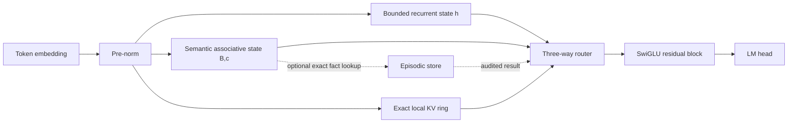

# Koemi-1FPA: First Prototype Architecture

## Goal

Define a Python-first sequence model that can be trained and served without
quadratic global attention, while preserving a precise local retrieval path
and an explicit long-term memory boundary. The design is a research baseline,
not a claim of Transformer parity.

## Scope

- Causal autoregressive language-model backbone.
- Stable recurrent state with bounded transition coefficients.
- Fixed-size semantic associative memory with an unambiguous write/read order.
- Small exact local key-value ring for copying and associative recall.
- Optional episodic memory outside the neural weights for exact, auditable recall.
- Parallel scan and chunked training paths that can be implemented in Python.
- Synthetic tests and benchmark gates that must precede scaling.
- JSON and JSONL input only in the first prototype, with adapters that normalize
  recognized dataset formats into one canonical record.
- Optional textual `thinking` supervision; records without it remain valid.

## Koemi-1FPA JSON data contract

The model core consumes only normalized JSON records. A `.json` file contains an
array of records; a `.jsonl` file contains one JSON object per line. CSV,
Parquet, Arrow, and vendor-specific objects do not enter the model directly.
They must pass through an adapter first.

Canonical record:

```json
{
  "id": "example-001",
  "input": "Explain how a queue works.",
  "thinking": null,
  "output": "A queue serves the first item that arrived first.",
  "metadata": {"source": "example"}
}
```

`id`, `input`, `thinking`, `output`, and `metadata` have fixed types. `thinking`
may be null or a string. `output` may be null for plain text documents, where
`input` is the complete training text. A missing `thinking` field is normalized
to null; it is not an error.

The serializer uses explicit control markers. For an instruction record it
emits input, optional thinking, and output in that order. For a plain text
record it emits the input only. The token loss covers the complete plain-text
sequence or the declared target fields of an instruction record. A thinking
loss is added only when `thinking` is present; internal deep computation is
separate from emitting visible thinking tokens.

Dataset adapters initially map common instruction or conversation fields such
as `instruction/input/output` and `conversations` into this contract. The
adapter is responsible for schema validation, malformed-record errors, length
limits, and an explicit mapping report. The Koemi core never guesses the
meaning of an arbitrary JSON field.

## Out of scope

- Claiming that Koemi replaces every Transformer workload.
- Production training, tokenizer selection, dataset licensing, or deployment.
- Automatic writing of private user data into model weights.
- Full deep test-time MLP memory in the first implementation.
- A custom CUDA/Triton kernel before a reference implementation is profiled.

## Acceptance criteria for the implementation phase

- Every state tensor has a declared shape, dtype policy, initialization, and
  causal update order.
- Sequential execution and the parallel scan path agree within a declared
  numerical tolerance in FP32 on random inputs.
- The recurrent state remains finite for at least 1,000,000 synthetic steps;
  no NaN or Inf is accepted.
- The training path allocates memory linear in sequence length and never builds
  a global T-by-T attention matrix.
- A reset test proves that one session cannot affect the next session's state.
- MQAR, copy, needle-in-haystack, long-context perplexity, tokens/second,
  peak VRAM, decode latency, and state bytes are reported against Mamba2,
  Gated DeltaNet, a local-attention Transformer, and a dense Transformer at
  matched parameter and token budgets.
- The router's missed-hard rate is measured on unfamiliar, contradictory, and
  out-of-distribution inputs; false cheap decisions have a higher penalty than
  unnecessary deep computation.
- JSON and JSONL loaders accept valid records with and without `thinking`, reject
  invalid types deterministically, and report every adapter transformation.
- Koemi is only called a Transformer substitute after it meets the measured
  quality and throughput gates on the target workload.

## Assumptions

- Vectors are column vectors; all linear maps use `W x`, not `x W`.
- The sequence is causal and indexed by `t = 1, ..., T`.
- `x_t` is the input representation at position `t`; the block predicts the
  next token from the output at `t`.
- The first proof uses PyTorch 2.x, BF16 activations, and FP32 recurrent state.
  JAX is a valid research backend because its documented associative scan is a
  direct match for the affine recurrences.
- Initial hyperparameters are `a_min = 2^-8`, `a_max = 1 - 2^-8`,
  `gamma_min = 2^-12`, `gamma_max = 1 - 2^-12`, `epsilon = 2^-6`,
  `lambda = 2^-4`, feature width `r = 64` or `128`, and local width
  `W_local = 128`. These are starting points for ablation, not results.

## Verdict

The useful idea in Titans/MIRAS is to treat sequence modeling as memory
management. The unsafe part for a first Koemi implementation is to make a deep
MLP's weights learn online at every token: it increases state size, creates a
non-linear sequential dependency, and makes hardware efficiency depend on a
fragile chunk approximation. Koemi-1 therefore uses an explicit bounded
associative state first and reserves state-dependent surprise for a later
experiment.

No fixed-size neural state can losslessly remember arbitrary unbounded context.
Koemi addresses this by assigning different jobs to different stores:

1. working state for continuous computation;
2. semantic state for compressed, reusable associations;
3. a small exact local buffer for recent token-level recall; and
4. optional episodic storage for facts that must be recalled exactly.

The fourth store is not a concession hidden in the design. If exact recall of
an arbitrary million-token document is a requirement, an explicit store is the
honest solution; a fixed vector cannot provide that guarantee.

## Evidence and design consequences

The Google Research article distinguishes Titans, a concrete architecture,
from MIRAS, a framework that chooses memory structure, attentional bias,
retention gate, and memory-learning algorithm. It describes attention as
short-term memory and online-updated neural memory as long-term memory:
[Google Research, “Titans + MIRAS”](https://research.google/blog/titans-miras-helping-ai-have-long-term-memory/).

The Titans paper defines its long-term memory by updating a neural module with
an associative-memory loss, momentum, and weight decay. Its own ablation gives
the largest gains to weight decay, momentum, convolution, and persistent
memory, while its efficiency section says the neural memory is slightly slower
than Mamba2 and Gated DeltaNet because of deep updates and kernel maturity:
[Titans paper](https://arxiv.org/html/2501.00663).

MIRAS is best treated as a design vocabulary rather than one finished model.
Its paper formalizes four choices and evaluates Moneta, Yaad, and Memora at
120M, 340M, 760M, and 1.3B parameters, with training contexts of 4K:
[MIRAS paper](https://arxiv.org/pdf/2504.13173).

The later TNT paper identifies the central practical problem directly: deep
test-time memory is expressive but its chunk size creates a quality/throughput
trade-off. TNT uses hierarchical global/local memory, periodic local resets,
and a second fine-tuning stage; its experiments report up to 17.37x speedup
over the most accurate Titans baseline, while also stating that the approach
does not yet beat highly optimized Transformer baselines:
[TNT paper](https://arxiv.org/abs/2511.07343).

The Zoology study is the reason Koemi contains a local exact buffer. It found
that associative-recall tokens accounted for 82% of the perplexity gap to
attention in the evaluated gated-convolution models, and that the gap persisted
at larger scale:
[Zoology paper](https://arxiv.org/pdf/2312.04927).

Mamba-2 shows that recurrent/state-space computation can be designed around
hardware-efficient scans, and xLSTM shows that gated recurrent memory can be
stabilized and scaled with modern residual backbones:
[Mamba-2 paper](https://arxiv.org/abs/2405.21060),
[xLSTM paper](https://arxiv.org/abs/2405.04517).

## Architecture map



## Precise state and update equations

The equations below define one Koemi block. Batch and layer indices are omitted
only to keep notation readable; each batch item and layer has an independent
copy of the state.

### 1. Normalization and projections

For `x_t in R^d`, define

`RMSNorm(x_t) = g ⊙ x_t / sqrt((1/d) * sum_{j=1}^d x_{t,j}^2 + epsilon)`

where `g in R^d` is learned and every operation in the denominator is scalar.
Set `u_t = RMSNorm(x_t)`. In Koemi-1, choose `d_v = d` so all three memory
branches have the same width. The key dimension `d_k` and feature dimension
`r` may differ:

`q_t = W_q u_t + b_q in R^(d_k)`

`k_t = W_k u_t + b_k in R^(d_k)`

`v_t = v_max * tanh((W_v u_t + b_v) / v_max) in R^(d_v)`

`qbar_t = q_t / (||q_t||_2 + epsilon)`

`kbar_t = k_t / (||k_t||_2 + epsilon)`

The bounded value projection prevents one outlier token from generating an
unbounded write.

### 2. Bounded recurrent working state

Let `h_t in R^d`, `h_0 in [-1,1]^d`, and let `sigma(z) = 1/(1+exp(-z))`.
All vector products in this subsection are elementwise:

`a_t = a_min + (a_max - a_min) * sigma(W_a u_t + b_a)`

`g_t = tanh(W_h u_t + b_h)`

`h_t = a_t ⊙ h_(t-1) + (1 - a_t) ⊙ g_t`

Because `0 < a_min <= a_t <= a_max < 1` and both inputs to the convex
combination lie in `[-1,1]`, `h_t` remains in `[-1,1]^d` by induction. This is
the primary numerical-stability invariant.

For parallel training, write `b^h_t = (1-a_t) ⊙ g_t`. Each step is the affine
map `h_t = a_t ⊙ h_(t-1) + b^h_t`. Two steps compose as

`(a_1,b_1) o (a_2,b_2) = (a_2 ⊙ a_1, a_2 ⊙ b_1 + b_2)`.

This operator is associative, so a prefix scan can calculate all `h_t`
without a Python loop over tokens.

### 3. Semantic associative memory

The memory uses a positive feature map instead of a full dense fast-weight
MLP. Let `P in R^(r x d_k)` and `b_phi in R^r` be slow learned parameters.
For any `z in R^(d_k)`, first define `a(z) = P z + b_phi` and
`a_max(z) = max_{i=1,...,r} a_i(z)`. Then define:

`phi_j(z) = exp(a_j(z) - a_max(z)) /
            sum_{i=1}^r exp(a_i(z) - a_max(z))`

Thus `phi(z) in R^r`, every component is positive, and its components sum to
one. The subtraction of the maximum is part of the definition, not merely an
implementation suggestion.

The state is `B_t in R^(d_v x r)` and `c_t in R^r`, initialized as
`B_0 = 0` and `c_0 = 0`. State is stored in FP32. The base model uses gates
that depend on the current token only:

`w_t = sigma(w_w^T u_t + beta_w)`

`gamma_t = gamma_min + (gamma_max - gamma_min) *
           sigma(w_gamma^T u_t + beta_gamma)`

with `0 <= w_t <= 1` and `0 < gamma_min <= gamma_t <= gamma_max < 1`.

The read happens before the current token is written:

`m_t = B_(t-1) * (phi(qbar_t) / (c_(t-1) + lambda)) in R^(d_v)`

where `/` is elementwise broadcasting of the denominator across rows of
`B_(t-1)`. The write then happens:

`B_t = gamma_t * B_(t-1) + w_t * v_t * phi(kbar_t)^T`

`c_t = gamma_t * c_(t-1) + w_t * (phi(kbar_t) ⊙ phi(kbar_t))`

The outer products have the declared shape `(d_v, r)`. This is a diagonal
feature-space approximation to exponentially weighted associative regression;
it intentionally avoids the `r x r` covariance solve in the first version.
Its cost per token is `O(d_v*r)` and its state is `d_v*r + r` scalars.

For scan training, define `Delta_B_t = w_t * v_t * phi(kbar_t)^T` and
`Delta_c_t = w_t * phi(kbar_t) ⊙ phi(kbar_t)`. The state pair
`(gamma, Delta_B, Delta_c)` composes as

`(gamma_1,D_B1,D_c1) o (gamma_2,D_B2,D_c2) =`

`(gamma_2*gamma_1, gamma_2*D_B1 + D_B2, gamma_2*D_c1 + D_c2)`.

This operator is associative. Therefore the semantic state has the same
parallel-scan property as the working state, provided the gates remain
token-dependent. A full covariance memory can be tested later; it is not the
default because its per-token solve and numerical conditioning would obscure
the first baseline.

### 4. Optional surprise gate, phase 2 only

Titans uses a gradient-derived surprise signal. Koemi can add a bounded version
after the base scan is correct:

`e_t = v_t - m_t`

`s_t = ||e_t||_2 / (||v_t||_2 + ||m_t||_2 + epsilon)`

`w'_t = w_t * s_t`

The ratio lies in `[0,1)` by the triangle inequality. At inference, `m_t` is
available from the prior state and the update is causal. During training,
`s_t` depends on the prior memory state and therefore makes the recurrence
non-linear. The training implementation must choose one of two explicit modes:

- exact sequential mode for quality reference and inference;
- chunk mode, where all `s_t` values in a chunk are computed from the detached
  state at the chunk boundary, followed by an affine scan inside the chunk.

The chunk mode is an approximation and must be reported as such. It cannot be
described as exact online training.

### 5. Exact local retrieval buffer

Let `K_(t-1) in R^(W_local x d_k)` and `V_(t-1) in R^(W_local x d_v)` contain
the previous local keys and values, with invalid slots masked. The local read
is:

`alpha_t = softmax((K_(t-1) qbar_t) / tau_local)`

`l_t = V_(t-1)^T alpha_t in R^(d_v)`

After the output for position `t` is computed, append `(kbar_t, v_t)` and drop
the oldest pair. The local buffer is causal and has fixed cost
`O(W_local * (d_k + d_v))` per token. It exists because a pure compressed
state is weak at exact key-value recall; `W_local` is deliberately small so
this is not global Transformer attention.

### 6. Branch routing and residual block

The three branches are combined by a learned simplex gate:

`rho_t = softmax(W_r u_t + b_r) in R^3`

`z_t = rho_t,1 * h_t + rho_t,2 * m_t + rho_t,3 * l_t`

`y_t = x_t + W_o z_t`

The result goes through a pre-norm SwiGLU residual sublayer:

`f_t = W_2 (SiLU(W_1 RMSNorm(y_t)) ⊙ W_3 RMSNorm(y_t))`

`x'_t = y_t + f_t`

The language-model head produces
`p_theta(token_(t+1) | token_<=t) = softmax(W_vocab x'_t + b_vocab)`.
The outer training loss is the causal cross entropy over non-padding positions.

### 7. State ownership and reset

Slow parameters `theta` are optimized only by the outer training loop. They do
not change during inference. A session owns `(h_t,B_t,c_t,K_t,V_t)` and can be
reset atomically. The reset operation sets

`h_0 = 0`, `B_0 = 0`, `c_0 = 0`, `K_0 = 0`, and `V_0 = 0`.

An optional episodic store is separate from the differentiable state. Every
entry needs a session/document identifier, source position, timestamp, write
reason, retention deadline, and deletion operation. Raw prompts and retrieved
private values must not be written to logs by default.

## Why this is cheaper and more stable than a Titans-like first version

Titans' long-term memory is a deep MLP whose parameters are updated online.
With a two-layer MLP and expansion `4d`, its fast state is approximately
`8d^2` weights before optimizer or activation overhead. Koemi-1's semantic
state is `d_v*r + r`, plus `d` working state and the fixed local ring.

For illustration, at `d = d_v = d_k = 4096`, `r = 256`, and
`W_local = 128`:

- two-layer `4d` MLP fast weights: `8d^2 = 134,217,728` scalars;
- Koemi semantic state: `d*r + r = 1,048,832` scalars;
- Koemi local keys and values: `2*W_local*d = 1,048,576` scalars;
- Koemi working state: `4,096` scalars.

The arithmetic is a state-size comparison, not a benchmark. Koemi still pays
for the ordinary slow projections and feed-forward layers. Its stability comes
from bounded `tanh` values, bounded gates, positive feature statistics, FP32
state, and no inner-loop gradient update in the base model.

## Python training plan

### Reference path

Implement the sequential cell first in ordinary PyTorch tensors. Use it for
correctness, causality, reset, and synthetic memory tests. The reference path
may use a Python loop only for tests and inference.

### Parallel path

Implement the affine pair composition for `h`, `b`, and `c`. JAX documents
`jax.lax.associative_scan` as a parallel scan over an associative operator:
[JAX associative scan](https://docs.jax.dev/en/latest/_autosummary/jax.lax.associative_scan.html).
In PyTorch, use the documented higher-order `scan` or a compiled equivalent
after the eager reference is correct:
[PyTorch scan](https://docs.pytorch.org/docs/main/higher_order_ops/scan.html).

Use fixed sequence-length buckets in the first benchmark. PyTorch's compiler
specializes on shapes and recompilation can dominate the measurement when
shapes vary unnecessarily:
[PyTorch compiler dynamic-shape guidance](https://docs.pytorch.org/docs/main/user_guide/torch_compiler/compile/programming_model.reducing_compile_time.html).

### Kernel path

Profile the compiled reference before writing a kernel. If the bottleneck is
the fused feature/write/read operation, implement only that operation in
Triton; Triton is a Python-based environment for custom GPU kernels:
[Triton documentation](https://triton-lang.org/main/index.html).

### Training stages

1. **Numerical baseline:** token-only gates, no surprise, diagonal semantic
   state, `W_local = 128`, short contexts.
2. **Recall baseline:** MQAR, copy, and needle tests; vary `r` and `W_local`
   without changing the optimizer or data budget.
3. **Long-context scaling:** train with chunked scans and measure 4K, 16K,
   64K, and 1M-token synthetic sequences.
4. **Surprise experiment:** add `s_t`, compare exact sequential inference with
   the detached-boundary chunk approximation, and measure the quality gap.
5. **Hierarchical experiment:** only if phase 4 is valuable, add a global
   semantic state plus reset local states following the TNT idea.
6. **Scale-up:** 100M, then 350M, then 1B only when the previous size passes
   the numerical, recall, and throughput gates.

## Benchmark and failure gates

The baseline must be compared on the same tokenizer, corpus slice, optimizer,
token budget, precision, hardware, and evaluation code. Report medians and p95
for throughput and latency, not a single warm run.

Required measurements:

- training tokens/second, wall-clock to a fixed validation loss, and peak VRAM;
- decode tokens/second with one stream and with the target batch size;
- recurrent-state bytes per layer and total bytes per session;
- validation perplexity at each context length;
- MQAR, copy, key-value retrieval, BABILong/RULER needle tests;
- reset isolation and state drift after repeated sessions;
- NaN/Inf count, gate ranges, minimum/maximum state norms, and write-rate
  distribution.

The first architecture is rejected if it is stable but cannot beat the chosen
baseline on the target recall task, or if its local branch grows until it is
effectively a global attention implementation. The correct fallback is to
retain Koemi as a recurrent serving model with external retrieval, not to
declare a Transformer replacement from a language-model perplexity number.

## Security and privacy boundary

Test-time memory is mutable state. It must be scoped by session and tenant,
resettable, bounded, and excluded from shared model weights. External episodic
memory requires validated input, explicit retention, access control, deletion,
and a source trail. The jurisdiction and legal basis for storing personal data
must be confirmed before production storage; this document is an architectural
constraint, not legal advice.

## Adaptive cognition review

The proposed next-token predictor is valid, but the cognitive state must be a
typed fusion rather than an unqualified sum. Let `S_t`, `M_t`, `C_t`, and `R_t`
be states with arbitrary widths. Project them to a common width `d_z` and
concatenate them:

`z_t = W_z [P_S S_t || P_M M_t || P_C C_t || P_R R_t] + b_z`

The predictor then emits logits, not a token:

`ell_t = W_vocab z_t + U_x x_t + b_vocab`

`p_theta(x_(t+1) | x_<=t) = softmax(ell_t / tau)`

The sampled or argmax token is a later decoding decision. This keeps the
probability distribution explicit and permits separate prediction heads without
assuming that `W h_t` is the only possible output map.

Five paths are useful only if they have distinct dynamics or data roles. A
token-time update alone is not reasoning, so use two indices:

`H_(t,0)^(i) = P_i u_t`

`H_(t,j+1)^(i) = F_i(H_(t,j)^(i), u_t, M_t)` for `j = 0,...,J_t-1`

`R_t = sum_(i in A_t) pi_(t,i) O_i(H_(t,J_t)^(i))`

Here `i in {1,...,5}`, `A_t` is the discrete set of active paths, and
`pi_t = softmax(r_t)` over `A_t`. `J_t` is the number of internal cognitive
steps. If `J_t = 1` and all five paths are active for every token, this is a
multi-branch recurrent block, not a reasoning system and not a cost reduction.

The router must decide a discrete budget before executing expensive paths:

`A_t = {i : sigmoid(q_i(u_t)) >= tau_i}`

subject to

`sum_(i in A_t) cost_i <= budget_t`

The first implementation should use a fast path with `A_t = {1}` and a deep
path with a small maximum `J_t`. A soft gate can train the router, but the
measured inference path must use hard routing, batching by route, and a load
balance penalty. Otherwise every path still runs and the router only changes
the weighted sum.

Define the difficulty signal as normalized observables, not as a free-form
intuition. For vocabulary size `V`, predictive distribution `p_t`, memory read
`m_t`, value `v_t`, query `q_t`, and local keys `K_t`:

`uncertainty_t = -sum_{a=1}^V p_t(a) log(p_t(a)) / log(V)`

`conflict_t = ||v_t - m_t||_2 / (||v_t||_2 + ||m_t||_2 + epsilon)`

`novelty_t = 1 - max_j cosine(q_t, K_(t,j))`

with `novelty_t = 1` when the local buffer is empty. Then:

`D_t = sigmoid(w_D^T [uncertainty_t, conflict_t, novelty_t]^T + b_D)`

`budget_t = budget_min + floor(D_t * (budget_max - budget_min))`

### Unknown-case safety rule

Adaptive computation must not equate low cost with low uncertainty. A model can
be confidently wrong on an unfamiliar input, so confidence alone is not a safe
router signal. The pre-output controller therefore computes a cheap risk score:

`risk_t = sigmoid(w_R^T [uncertainty_t, conflict_t, novelty_t, disagreement_t]^T + b_R)`

where `disagreement_t` is the normalized disagreement among cheap prediction or
verification heads. The deep path is selected when risk exceeds its threshold,
when a verifier rejects the fast preview, or when the exploration quota requires
coverage:

`deep_t = 1[risk_t >= tau_R] OR 1[verify_t < tau_verify] OR 1[coverage_t < p_min]`

The router loss is asymmetric:

`L_route = lambda_miss * 1[hard_t AND fast_t] + lambda_compute * cost_t`

with `lambda_miss` deliberately larger than `lambda_compute`. The label
`hard_t` can be measured during training by whether the deep path improves the
held-out prediction loss by at least a declared margin. At inference, the
controller must be allowed to spend extra compute on unfamiliar cases. Deep
computation can compose learned primitives, but it cannot manufacture missing
facts; factual gaps need retrieval, tools, or an explicit uncertain answer.

Next-token surprisal is a post-token signal because the true next token is not
known before prediction. It may update memory or route the following step, but
the current pre-output decision must use predictive uncertainty, conflict,
novelty, disagreement, and calibrated verification signals.

The next-token predictor is both the training target and the cheap preview. It
does not replace thinking by itself. It can save compute only when a low-risk
preview is allowed to stop early; a high-risk preview must escalate to the deep
paths. Let `L_fast` and `L_deep` be the expected prediction losses and `F_fast`
and `F_deep` their measured compute costs. The preferred decision rule is:

`deep_t = 1[risk_t >= tau_R] OR 1[(L_fast - L_deep) > lambda_F * (F_deep - F_fast)] OR 1[coverage_t < p_min]`

The second term means: spend more compute when the expected quality gain is
worth the extra cost. The risk and coverage terms protect against a model that
is confidently wrong or has never explored an input type.

Memory writes should also reward useful, reliable information rather than raw
surprise:

`write_t = sigmoid(theta_N * novelty_t + theta_R * relevance_t + theta_C * confidence_t + theta_U * future_use_t - theta_K * write_cost_t + b_write)`

`M_(t+1) = gamma_t * M_t + write_t * candidate_t`

If confidence is below a declared floor and there is no verification, the
candidate is not promoted to durable memory. This reduces the chance that a
hallucination becomes a remembered fact.

The formula `I*R*C/(K+E+epsilon)` is acceptable as a diagnostic score, but it
is not a stable training objective: its scale is arbitrary, zero factors kill
the signal, and the router can learn to manipulate the denominator. The
trainable objective should instead make the trade-off explicit:

`L_total = L_NLL + lambda_F * E[FLOPs] + lambda_M * E[RAM]`

plus load-balance and path-specific auxiliary losses when they are measurable.
The project goal is therefore a constrained Pareto frontier of quality,
retention, latency, and memory, not a single universal intelligence quotient.

The hierarchy should start with three concrete contracts:

- `L0`: bounded working state, reset per session;
- `L1`: semantic associative state, decayed and differentiable;
- `L2`: episodic external store, exact and auditable.

`L3` consolidated knowledge is the offline-trained slow model. A concept state
is a projection or readout until a separate format and promotion rule prove that
it deserves its own persistent level. This prevents four names from hiding one
untyped memory tensor.

## Sources

- Behrouz, Zhong, and Mirrokni. [Titans: Learning to Memorize at Test Time](https://arxiv.org/html/2501.00663).
- Behrouz, Razaviyayn, Zhong, and Mirrokni. [It's All Connected: A Journey Through Test-Time Memorization, Attentional Bias, Retention, and Online Optimization](https://arxiv.org/pdf/2504.13173).
- Li et al. [TNT: Improving Chunkwise Training for Test-Time Memorization](https://arxiv.org/abs/2511.07343).
- Lialin et al. [Zoology: Measuring and Improving Recall in Efficient Language Models](https://arxiv.org/pdf/2312.04927).
- Dao and Gu. [Transformers are SSMs: Generalized Models and Efficient Algorithms Through Structured State Space Duality](https://arxiv.org/abs/2405.21060).
- Beck et al. [xLSTM: Extended Long Short-Term Memory](https://arxiv.org/abs/2405.04517).
